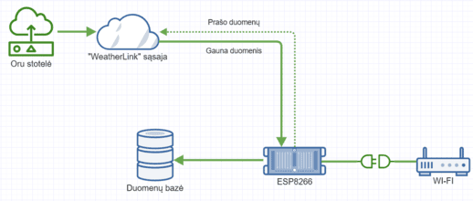
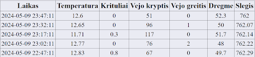

# Weather Data Collector

**Status:** archived.

**Maintenance:** I will **not** return to this project; no further changes will be made.

**Stability:** stable.

## Summary
This project is designed to collect and display meteorological data. The ESP-01 Wi-Fi module collects real-time data from various weather websites and stores it in a database for later analysis. I made this in 2024.




## Table of contents
- [Features](#features)  
- [Prerequisites](#prerequisites)  
- [Getting started](#getting-started)  
- [Problems I solved](#problems-i-solved)  
- [What I learned](#what-i-learned)  
- [Files](#files)  

## Features

- Collects meteorological data using ESP-01 Wi-Fi module from weather websites.
- Stores data in a database for historical analysis.
- Displays data in a table format.
- Exports data into a csv file.

## Prerequisites

- ESP-01 Wi-Fi module.
- Arduino UNO.
- Arduino IDE.
- Internet connection.
- Weather API key from your preferred data source.
- Web server to host the database and display the data.

## Getting Started

### 1. Wiring the ESP-01 with Arduino UNO

-	ESP8266 RXD -> Arduino UNO RX.
-	ESP8266 GPIO0 -> Arduino UNO GND (only during programming).
-	ESP8266 GND -> Arduino UNO GND.
-	ESP8266 VCC -> Arduino UNO 3.3V.
-	ESP8266 CH_PD -> Arduino UNO 3.3V.
-	ESP8266 TXD -> Arduino UNO TX.

### 2. Getting the files

You have two options to get the files:

  1. **Clone the repository**:
     - Open a terminal or command prompt.
     - Run the following command:
     ```sh
     git clone https://github.com/EiguliteDev/Weather-Data-Collector.git
     ```

  2. **Download the ZIP**:
     - Click "Code" and select "Download ZIP".
     - Extract the ZIP file.

### 3. Configuring the Arduino IDE

- Open the Arduino IDE.
- Go to File > Preferences.
- In the "Additional Board Manager URLs" field, add http://arduino.esp8266.com/stable/package_esp8266com_index.json.
- Go to Tools > Board > Board Manager, search for "esp8266" and install the package.
- Select Generic ESP8266 Module under Tools > Board.
- Select COM3 port under Tools > Port.
- Go to Sketch > Include Library > Manage Libraries.
- In the Library Manager, search for ArduinoJson.
- Click Install to add the library to your Arduino IDE.

### 4. Uploading the code

- Open the sketch `sketch_apr1a.ino` from the repository in the Arduino IDE.
- Make sure the GPIO0 pin of the ESP-01 is connected to GND for programming mode.
- Upload the code to the ESP-01.

### 5. Setting up the website

- Host a website.
- Upload `data-fetch.php`, `data-save.php`, `index.html`, `style.css`, `script.js` files and configure them.
- Ensure the database is set up to receive data from the ESP-01.

## Problems I solved
- **No historical telemetry.** Most weather APIs publish only current (real-time) data. I designed and implemented a system that collects periodic weather data from APIs, stores it to a database, and displays it through a simple web dashboard. This gives the ability to analyze historical telemetry.

## What I learned
- **Embedded networking (ESP8266):** practical experience configuring and programming the ESP-01 module, and handling flash/upload modes.
- **Full stack basics:** flashing and debugging Arduino sketches, building a simple PHP API, and building a minimal web UI with CSV export.

### Files

- `sketch_apr1a.ino`: ESP-01 script for receiving and sending data.
- `data-fetch.php`: Script for getting the data out of the database.
- `data-save.php`: Script for sending the received data to the database.
- `index.html`: Main website file for displaying the meteorological data.
- `style.css`: File for styling the website.
- `script.js`: Script for function like exporting data into a csv file.

#### This project is licensed under the MIT License. See the `LICENSE` file for details.
